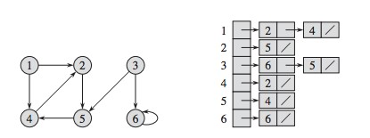
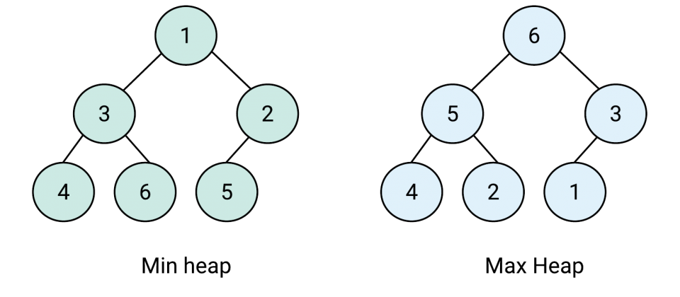

This tutorial explains what data structures and algorithms to use while performing data operations on a stream.

But before that, let me briefly explain ComposeDB structure and components.

ComposeDB provides a graph structure for interacting with data on the Ceramic network.

The [nodes](https://composedb.js.org/docs/0.3.x/guides/concepts-overview#nodes) in the graph can be [accounts](https://composedb.js.org/docs/0.3.x/guides/concepts-overview#accounts) or [documents](https://composedb.js.org/docs/0.3.x/guides/concepts-overview#documents), while the edges in the graph represent relations between nodes.

Documents are [Ceramic streams](https://developers.ceramic.network/learn/advanced/overview/#streams) defined by [models](https://composedb.js.org/docs/0.3.x/guides/concepts-overview#models). Models are created using [GraphQl schema](https://graphql.org/learn/schema/).

Composites are set of Models created using Schema file based on GraphQL.
Example of composite schema:

```
type Profile @createModel(accountRelation: SINGLE, description: "Very basic profile") {
  displayName: String! @string(minLength: 3, maxLength: 50)
}

type Note @createModel(accountRelation: LIST, description: "Very basic note") {
  author: DID! @documentAccount
  version: CommitID! @documentVersion
  title: String! @string(minLength: 10, maxLength: 100)
  text: String @string(maxLength: 2000)
}
```

So at the root level, to make our app efficient, we need to have an efficient Schema!!

# Large data

If the data is very large, then it may not be a good idea to use a list for storing it.
But the thing to note is in GraphQL, we only have Array/list as the data structure available.

## Some methods to store Large data using the list:

### 1. Store graphical data in an **Adjacency list**

In this method, we make a 2D list. Every index of the list stores another list containing the nodes that **index number** it is pointing to. For eg, in the below example 3rd index stores a list containing 6 and 5 as node 3 is pointing towards 6 and 5 in graph. <br>


```
type indexList {
  leafs: [Integer]
}

type adjacencyList {
  graphData: [indexList!]
}
```

V - vertices, E - edges <br>
Space complexity = O(|V| + |E|) <br>
Time Complexity: <br>

-   Adding vertex or edge = O(1) <br>
-   Removing a vertex = O(|V|+|E|) <br>
-   Removing an edge = O(|E|) <br>
-   Querying = O(|V|) <br>

### 2. Store data in a **Heap**

Heaps are a great way to find the minimum or maximum value quickly.

There are 2 types of heap:


Min heap - stores the minimum value in the root. Leaf values are always greater than equal to the parent node.

Max heap - stores the maximum value in the root. Leaf values are always lesser than equal to the parent node.

Time Complexity: <br>
Get Maximum or Minimum Element: O(1) <br>
Insert Element into Max-Heap or Min-Heap: O(log N) <br>
Remove Maximum or Minimum Element: O(log N) <br>

# Searching in a List

There are mainly 2 cases of searching an entry in a field of type **list**:

### 1. List is Sorted

In this case, we can use the **Binary search** algorithm to find the entry fastest.
Time Complexity = log(n)

### 2. List is Unsorted

In this case, we have to use **Linear search** algorithm
Time Complexity = n

# Smaller Models VS Larger Models

### Advantages of Smaller Models

-   They are more modular.
-   Easier to compose in different combinations
-   Allow apps to depend on exactly the data they need and no more.

### Advantages of Larger Models

-   Data belongs to a single Model and can be updated **atomically**.

Everything will be clear from the given below example:

Consider if you wanted to store a user’s address. One possibility is to have a single Model that stores the entire address, where documents within that Model would look something like this:

```
{
  street: '123 main street',
  city: 'boston',
  state: 'MA'
}
```

Another possibility is to have 3 Models:

1. address_street Model

```
{street: '123 main street'}
```

2. address_city Model

```
{city: 'boston'}
```

3. address_state Model

```
{state: 'MA'}
```

This would allow an app to index all the users who live in Massachusetts without also needing to index what city they live in or what their street address is.

**But** the problem with this structure, however, would be that if the user were to move to a new address in a new state, the update to each of the 3 address documents in the 3 Models would happen independently - meaning they could be reordered, an app could learn about one but not the other two, or one of the writes could even fail entirely while the other two succeed. This could lead to inconsistent views about where the user actually lives.

So the key point in deciding the model's size is to consider its use. If there is a strong relationship between the fields, go for Large models otherwise, Small models.
